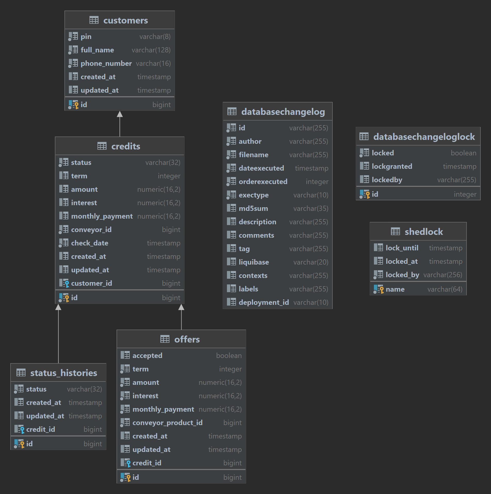

## ms.credit-manager

### Table of Contents

- [Database structure](#Database-structure)
- [Run](#Run)
- [Tech stack](#Tech-stack)
- [API](#API)

### Database structure



### Run

Execute the following command and run the application on Intellij IDEA:

```shell script
$ docker compose up -d
```

### Tech stack

1. Spring Boot
2. Java 17
3. Spring Cloud (OpenFeign)
4. Schedlock

### API

[Swagger](http://localhost:8080/swagger-ui/index.html)

[Postman](postman/postman-collection.json)